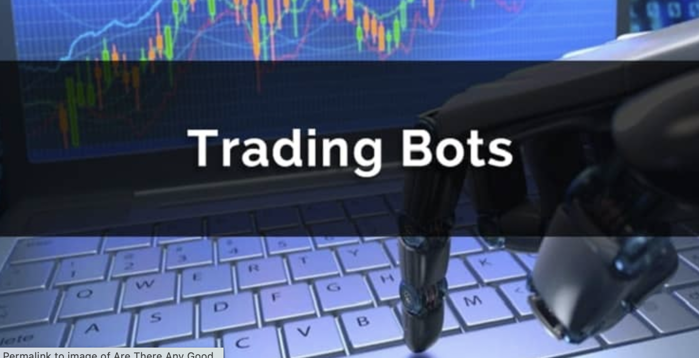
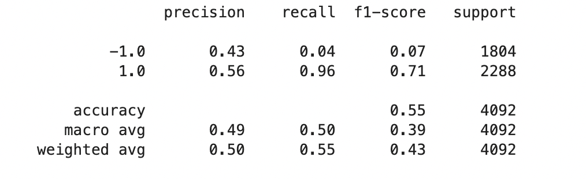
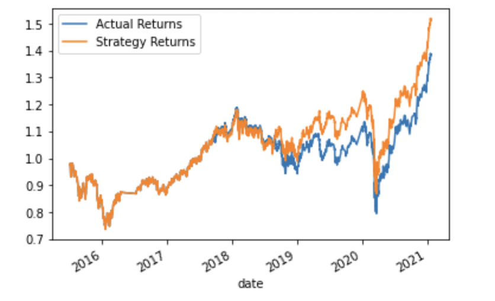
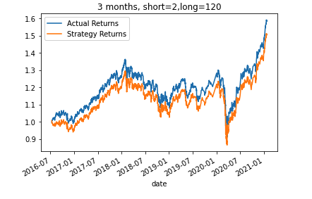
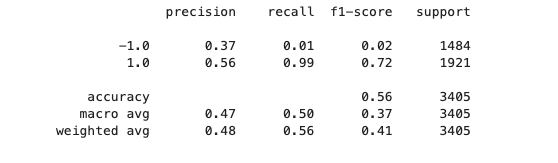
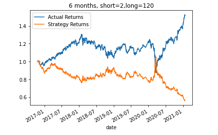
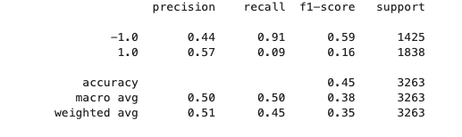
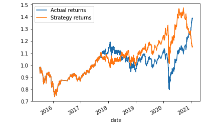
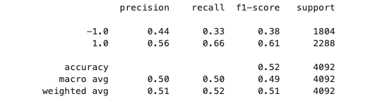

# Trading_bot

This application uses computer algorithms that can buy and sell faster than human traders, enhancing trading signals with machine learning algorithms that can adapt to new data.

## Sections and steps taken:

### Establish a Baseline Performance:
    
        - Import the OHLCV dataset into a Pandas DataFrame
        
        - Generate trading signals using short- and long-window SMA values
        
        - Split the data into training and testing datasets
        
        - Use the `SVC` classifier model from SKLearn's support vector machine (SVM) learning method to fit the training data and make predictions based on the testing data
        
        - Review the classification report associated with the `SVC` model predictions
        
        - Create a predictions DataFrame that contains columns for “Predicted” values, “Actual Returns”, and “Strategy Returns”
        
        - Create a cumulative return plot that shows the actual returns vs. the strategy returns. Save a PNG image of this plot. This will serve as a baseline against which to compare the effects of tuning the trading algorithm.

   #### Performance of base model:

As we can see in the SVC report image above, the model's accuracy is 0.55 with a recall of 0.96 for classification 1 and of 0.04 for classification -1. Analysing the cumulative returns plot, we can see how the strategic returns reached 1.5 by 2021 whilst the actual returns only reached 1.4 by the same date. 

 

 
    

### Tune the Baseline Trading Algorithm

We tried to tune the algorithm in two different scenarios, the first one keeping the training at 3 months but with a short window of 2 and a long window of 120. In the second scenario, we increase the training period to 6 months and kept the short window to 2 and the long window to 120. As we can see in the plots and the reports below, the algorithm perfomed better with a 3 month training and a short window of 2 and long window of 120, with an accuracy of 0.56 and the strategy returns reaching 1.5 in comparison of the actual returns at 1.6.
    
    
     
    
 

### Introducing a New Machine Learning Classifier

We fitted a new Logistic Regression classifier model to the baseline data and we can see that the accuracy is 0.52 and with strategy returns dropping to 1.1 and the actual returns reaching 1.4 as we can see in the plots below. 
    
    
 

### Evaluation Report
    
As per the analysis above, the baseline model provided an accuracy of 0.55 with a recall of 0.96 for classification 1 and of 0.04 for classification -1,  The strategic returns reached 1.5 by 2021 whilst the actual returns only reached 1.4 by the same date. The Logistic Regression classifier model applied to the base model performed worse than such. The best performing model was the tuned base model with a 3 month training and a short window of 2 and long window of 120, with an accuracy of 0.56 and the strategy returns reaching 1.5 in comparison of the actual returns at 1.6.  

    
 

## Technologies

This application uses python 3.7.11 and the following packages:

* **pandas

* **tensorflow

* **scikit-learn

* **Jupyter lab

## Instructions

Use the `machine_learning_trading_bot.ipynb` notebook.

## Contributors

Jaime Aranda

---

## License

Licensed under the MIT License.

